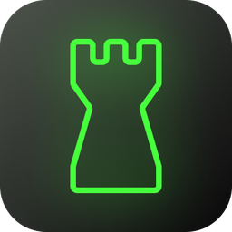

  
  <h1>gam-bit</h1>

 

Welcome to gam-bit: a clean, minimal interface for the Universal Chess Interface (UCI). It's ideal for casual chess players and chess engine developers alike, as it allows for human vs bot and bot vs bot games.

Well, that's what it's going to be :)
